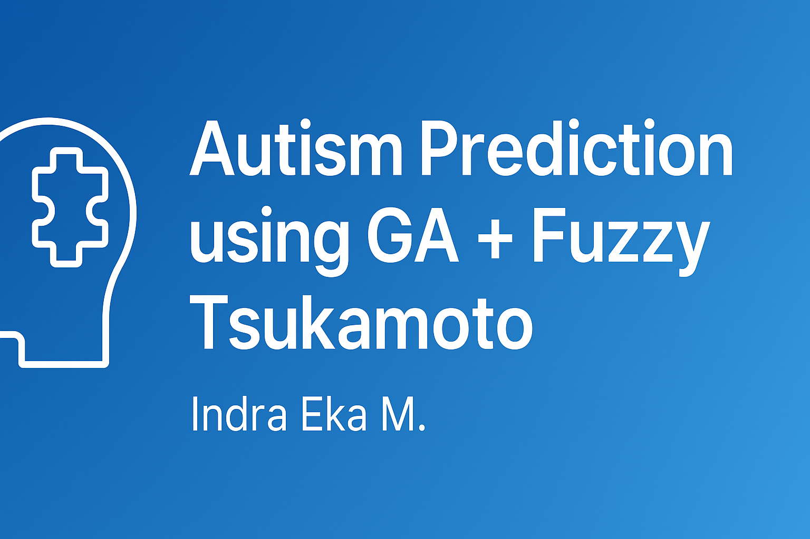

# 🧬 Autism Prediction using Genetic Algorithm and Fuzzy Tsukamoto

This project implements an expert system to predict the risk of **autism in children** using **Fuzzy Tsukamoto inference**, enhanced by a **Genetic Algorithm (GA)** for parameter optimization.  
The prediction is based on CARS (Childhood Autism Rating Scale) and CAT (Checklist for Autism in Toddlers) criteria.

---

## 🧠 Objective

- Predict autism tendency in children through CARS & CAT-based indicators.
- Apply Fuzzy Tsukamoto for rule-based reasoning.
- Use Genetic Algorithm to optimize fuzzy rule weights and thresholds.

---

## 🛠️ Technologies

- **Language**: Java
- **IDE**: NetBeans
- **Techniques**: Fuzzy Logic (Tsukamoto), Genetic Algorithm, Expert System

---

## 🚀 How to Run

1. Open the project with **NetBeans IDE**.
2. Run `tampilanAutisme.java`.
3. Input CARS and CAT scores.
4. Click “Predict” to generate result.
5. GA optimization runs behind the scenes to adjust fuzzy inference accuracy.

---

## 👨‍💻 Author

**Indra Eka Mandriana S.Kom**  
_Researcher in AI, Fuzzy Logic, and Evolutionary Computation_

---

## ⭐ If you find this project helpful, consider giving it a ⭐ on GitHub!
